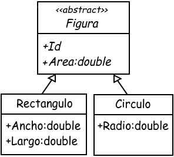
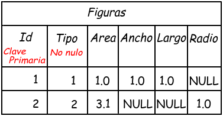
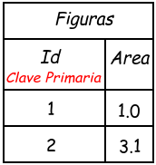
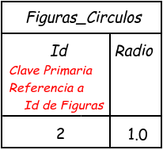
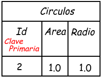

# Extracción 01 — «Integridad y restricciones. Mapeo de Herencia»

> **Fuente**: <https://docs.google.com/document/d/1ZkB2ylhtA6OHwBaDriGWs_FJ4-voSNAG/edit> — «UTN - FRP - TUP - Programación aplicada 2025 - Acceso a datos - SQL Server - Integridad y restricción. Mapeo de herencia», firmado *Filipuzzi, Fernando*.
>
> **Fecha de extracción**: 2026-09-05. Texto tomado del `document.xml` del `.docx` exportado; figuras extraídas de `word/media/`, sin recapturar.
>
> **Qué es esto**: la transcripción del apunte, sin agregados ni correcciones. **El SQL se transcribe tal como está**, incluso donde no compila — los defectos se listan aparte, en [Hallazgos-01-Herencia.md](Hallazgos-01-Herencia.md).
>
> **Repositorio que declara la fuente**: <https://github.com/UTN-FRP-TUP-Aplicada-2026/Ejemplos_integridad_y_restricciones_herencia> *(no verificado).*

---

## 1. Introducción

La fuente enuncia tres estrategias:

> a. Tabla por jerarquía (Table per hierarchy, TPH) o también, tabla única
> b. Tabla por Subclase (Table per Type, TPT)
> c. Tabla por Clase Concreta (Table per Concrete Class, TPC)

Y las compara en una tabla:

| Estrategia | **TPH** (Jerarquía) | **TPT** (Subclase) | **TPC** (Concreta) |
| --- | --- | --- | --- |
| **Ventajas** | Simple, una tabla única | Normalización, sin nulos | Consultas rápidas por subclase |
| **Desventajas** | Muchas columnas nulas | JOIN costosos | Duplicación de columnas |
| **Ejemplo ideal** | Jerarquías pequeñas y simples | Modelos grandes y normalizados | Cuando rara vez se consulta toda la jerarquía |
| **Requiere un campo adicional, discriminador** | Sí | *(celda vacía)* | *(celda vacía)* |
| **Modelo orientado a objetos** | *(una sola imagen, común a las tres)* | | |
| **Modelo relacional** | *(imagen)* | *(tres imágenes)* | *(dos imágenes)* |

Las tres últimas filas de esa tabla están incompletas en el original ([Hallazgos §1.6](Hallazgos-01-Herencia.md)).

### 1.1 El modelo de objetos, común a los tres ejemplos



```csharp
abstract class Figura
{
    public int Id { get; set; }
    public double Area { get; set; }
}

class Rectangulo : Figura
{
    public double Ancho { get; set; }
    public double Largo { get; set; }
}

class Circulo : Figura
{
    public double Radio { get; set; }
}
```

*(Transcripto de la celda «Modelo orientado a objetos» de la sección TPH, que es la única de las tres donde el C# está bien formado — ver [Hallazgos §1.5](Hallazgos-01-Herencia.md).)*

---

## 2. Tabla por Jerarquía (TPH)

> «Se guarda toda la jerarquía en una sola tabla, con una columna "discriminadora" para indicar el tipo de objeto.»
>
> **Ventaja**: «Sencillo y eficiente en consultas.»
> **Desventaja**: «Muchas columnas nulas si las subclases tienen atributos muy distintos.»

Archivo que nombra: `1_TPH_ejemplo.sql`



```sql
CREATE TABLE Figuras
(
    Id INT PRIMARY KEY IDENTITY(1,1),
    Tipo INT UNIQUE NOT NULL,
    Area DECIMAL(18,2),
    Ancho DECIMAL(18,2),
    Largo DECIMAL(18,2),
    Radio DECIMAL(18,2)
);
```

**La figura marca `Tipo` solo como «No nulo»; el SQL le agrega `UNIQUE`.** Es la divergencia más importante del documento ([Hallazgos §1.1](Hallazgos-01-Herencia.md)).

---

## 3. Tabla por Subclase (TPT)

> «Se usa una tabla para la clase base y una tabla extra por cada subclase. Se relacionan con clave primaria, que la misma al mismo tiempo que la clave foránea.»
>
> **Ventaja**: «Buena normalización, sin columnas nulas.»
> **Desventaja**: «Consultas más costosas (requieren JOIN).»

| | |
| :-: | :-: |
|  |  |
|  | |

**Las figuras nombran las tablas `Figuras_Rectangulos` y `Figuras_Circulos`; el SQL las llama `Rectangulos` y `Circulos`.**

```sql
CREATE TABLE Figuras
(
    Id INT PRIMARY KEY IDENTITY(1,1),
    Area DECIMAL(18,2)
);

CREATE TABLE Rectangulos
(
    Id INT,
    Ancho DECIMAL(18,2),
    Largo DECIMAL(18,2),
    CONSTRAINT PK_Rectangulos PRIMARY KEY Id,
    CONSTRAINT FK_Rectangulos_Figuras FOREIGN KEY Id REFERENCES Figuras(Id)
        ON DELETE CASCADE ON UPDATE CASCADE
);

CREATE TABLE Circulos
(
    Id INT,
    Ancho DECIMAL(18,2),
    Largo DECIMAL(18,2),
    CONSTRAINT PK_Circulos PRIMARY KEY Id,
    CONSTRAINT PK_Rectangulos_Figuras FOREIGN KEY Id REFERENCES Figuras(Id)
        ON DELETE CASCADE ON UPDATE CASCADE
);
```

*(Transcripto literal. Ni `PRIMARY KEY Id` ni `FOREIGN KEY Id` llevan paréntesis, `Circulos` tiene `Ancho` y `Largo` en vez de `Radio`, y su clave foránea se llama `PK_Rectangulos_Figuras` — ver [Hallazgos §1.2, §1.3 y §1.4](Hallazgos-01-Herencia.md).)*

### 3.1 La consulta «getById» que trae la fuente

```sql
-- Tabla Base
DECLARE @Figuras TABLE (
    Id INT PRIMARY KEY,
    Area DECIMAL(10,2)
);

-- Tabla Especializada: Rectángulos
DECLARE @Figuras_Rectangulos TABLE (
    Id INT PRIMARY KEY,   -- También es FK a @Figuras
    Ancho DECIMAL(10,2),
    Largo DECIMAL(10,2)
);

-- Tabla Especializada: Círculos
DECLARE @Figuras_Circulos TABLE (
    Id INT PRIMARY KEY,   -- También es FK a @Figuras
    Radio DECIMAL(10,2)
);

-- Insertar en la tabla base
INSERT INTO @Figuras (Id, Area) VALUES (1, 1.0), (2, 3.14);

-- Insertar detalles de Rectángulo (Id 1)
INSERT INTO @Figuras_Rectangulos (Id, Ancho, Largo) VALUES (1, 1.0, 1.0);

-- Insertar detalles de Círculo (Id 2)
INSERT INTO @Figuras_Circulos (Id, Radio) VALUES (2, 1.0);

DECLARE @ID_QUERY INT = 2;   -- Cambia este valor (1 o 2) para probar

SELECT a.Id,
       Tipo = CASE
                WHEN r.Id IS NOT NULL THEN 'Rectangulo'
                WHEN c.Id IS NOT NULL THEN 'Circulo'
                ELSE 'No definido'
              END,
       a.Area, r.Largo, r.Ancho, c.Radio
FROM @Figuras AS a
LEFT JOIN @Figuras_Rectangulos r ON a.Id = r.Id
LEFT JOIN @Figuras_Circulos    c ON a.Id = c.Id
WHERE a.Id = @ID_QUERY;
```

**Es la única parte del documento donde el SQL sí es coherente**: usa los nombres de las figuras y le da `Radio` a los círculos.

---

## 4. Tabla por Clase Concreta (TPC)

> «Cada clase hija tiene su propia tabla independiente, duplicando las columnas de la clase base.»
>
> **Ventaja**: «No requiere JOIN, consultas directas.»
> **Desventaja**: «Duplicación de datos, poca consistencia si cambia la clase base.»

| | |
| :-: | :-: |
|  |  |

```sql
CREATE TABLE Rectangulos
(
    Id INT PRIMARY KEY IDENTITY(1,1),
    Area DECIMAL(18,2),
    Ancho DECIMAL(18,2),
    Largo DECIMAL(18,2),
    CONSTRAINT PK_Rectangulos PRIMARY KEY Id
);

CREATE TABLE Circulos
(
    Id INT PRIMARY KEY IDENTITY(1,1),
    Area DECIMAL(18,2),
    Ancho DECIMAL(18,2),
    Largo DECIMAL(18,2),
    CONSTRAINT PK_Circulos PRIMARY KEY Id
);
```

*(Transcripto literal: las dos tablas declaran la clave primaria dos veces, y `Circulos` vuelve a tener `Ancho` y `Largo` donde la figura dice `Radio` — ver [Hallazgos §1.3 y §1.7](Hallazgos-01-Herencia.md).)*

---

## 5. Referencias que trae la fuente

| Referencia | Enlace |
| --- | --- |
| EntityFramework Inheritance — Microsoft Learn | <https://learn.microsoft.com/en-us/ef/core/modeling/inheritance> |
| Modeling Performance — Microsoft Learn | <https://learn.microsoft.com/en-us/ef/core/performance/modeling-for-performance> |
| Tutorial: Implement Inheritance with EF | ASP.NET MVC getting-started |
| Database Designs for Representing Object Inheritance | Medium — Adam HVT |
| Inheritance Mapping in Databases: TPH, TPT, TPC | Medium — Sema Topcu |
| How and When to Use TPC Inheritance Mapping in EF Core | code-maze.com |
| Lerman. *Programming Entity Framework. Code First* | Google Drive |
| Peres R. *Entity Framework Core Cookbook* | Google Drive |
| Smith J. *Entity Framework Core in Action* | Google Drive |

**Las nueve referencias son de la industria** —documentación de producto, artículos y libros sobre un mapeador concreto—. No hay ninguna académica.

---

## 6. Lo que esta extracción no cubre

| Ausencia | Tipo | Motivo |
| --- | --- | --- |
| El repositorio de ejemplos de GitHub | Pendiente | No se abrió |
| Que los scripts corran | Pendiente | No se ejecutó ninguno; varios no compilarían |
| Las imágenes decorativas del encabezado | No aplica | Cuatro imágenes de la maqueta —íconos de enlace y separadores— quedaron fuera |
